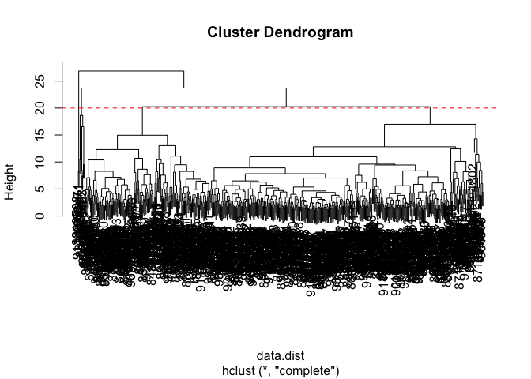
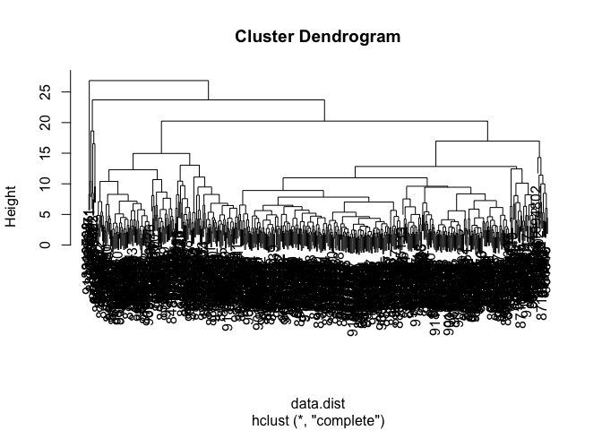
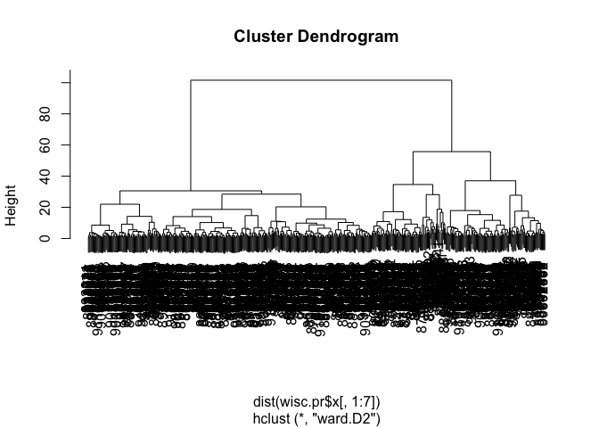

hw8_miniproject
================

## Preparing the data

``` r
# Save your input data file into your Project directory
fna.data <- "WisconsinCancer.csv"

# Complete the following code to input the data and store as wisc.df
wisc.df <- read.csv(fna.data, row.names=1)
head(wisc.df)
```

             diagnosis radius_mean texture_mean perimeter_mean area_mean
    842302           M       17.99        10.38         122.80    1001.0
    842517           M       20.57        17.77         132.90    1326.0
    84300903         M       19.69        21.25         130.00    1203.0
    84348301         M       11.42        20.38          77.58     386.1
    84358402         M       20.29        14.34         135.10    1297.0
    843786           M       12.45        15.70          82.57     477.1
             smoothness_mean compactness_mean concavity_mean concave.points_mean
    842302           0.11840          0.27760         0.3001             0.14710
    842517           0.08474          0.07864         0.0869             0.07017
    84300903         0.10960          0.15990         0.1974             0.12790
    84348301         0.14250          0.28390         0.2414             0.10520
    84358402         0.10030          0.13280         0.1980             0.10430
    843786           0.12780          0.17000         0.1578             0.08089
             symmetry_mean fractal_dimension_mean radius_se texture_se perimeter_se
    842302          0.2419                0.07871    1.0950     0.9053        8.589
    842517          0.1812                0.05667    0.5435     0.7339        3.398
    84300903        0.2069                0.05999    0.7456     0.7869        4.585
    84348301        0.2597                0.09744    0.4956     1.1560        3.445
    84358402        0.1809                0.05883    0.7572     0.7813        5.438
    843786          0.2087                0.07613    0.3345     0.8902        2.217
             area_se smoothness_se compactness_se concavity_se concave.points_se
    842302    153.40      0.006399        0.04904      0.05373           0.01587
    842517     74.08      0.005225        0.01308      0.01860           0.01340
    84300903   94.03      0.006150        0.04006      0.03832           0.02058
    84348301   27.23      0.009110        0.07458      0.05661           0.01867
    84358402   94.44      0.011490        0.02461      0.05688           0.01885
    843786     27.19      0.007510        0.03345      0.03672           0.01137
             symmetry_se fractal_dimension_se radius_worst texture_worst
    842302       0.03003             0.006193        25.38         17.33
    842517       0.01389             0.003532        24.99         23.41
    84300903     0.02250             0.004571        23.57         25.53
    84348301     0.05963             0.009208        14.91         26.50
    84358402     0.01756             0.005115        22.54         16.67
    843786       0.02165             0.005082        15.47         23.75
             perimeter_worst area_worst smoothness_worst compactness_worst
    842302            184.60     2019.0           0.1622            0.6656
    842517            158.80     1956.0           0.1238            0.1866
    84300903          152.50     1709.0           0.1444            0.4245
    84348301           98.87      567.7           0.2098            0.8663
    84358402          152.20     1575.0           0.1374            0.2050
    843786            103.40      741.6           0.1791            0.5249
             concavity_worst concave.points_worst symmetry_worst
    842302            0.7119               0.2654         0.4601
    842517            0.2416               0.1860         0.2750
    84300903          0.4504               0.2430         0.3613
    84348301          0.6869               0.2575         0.6638
    84358402          0.4000               0.1625         0.2364
    843786            0.5355               0.1741         0.3985
             fractal_dimension_worst
    842302                   0.11890
    842517                   0.08902
    84300903                 0.08758
    84348301                 0.17300
    84358402                 0.07678
    843786                   0.12440

Diagnosis should contain the diagnosis column from wisc

``` r
wisc.data <- wisc.df[,-1]
diagnosis <- wisc.df$diagnosis
head(diagnosis)
```

    [1] "M" "M" "M" "M" "M" "M"

``` r
head(wisc.data)
```

             radius_mean texture_mean perimeter_mean area_mean smoothness_mean
    842302         17.99        10.38         122.80    1001.0         0.11840
    842517         20.57        17.77         132.90    1326.0         0.08474
    84300903       19.69        21.25         130.00    1203.0         0.10960
    84348301       11.42        20.38          77.58     386.1         0.14250
    84358402       20.29        14.34         135.10    1297.0         0.10030
    843786         12.45        15.70          82.57     477.1         0.12780
             compactness_mean concavity_mean concave.points_mean symmetry_mean
    842302            0.27760         0.3001             0.14710        0.2419
    842517            0.07864         0.0869             0.07017        0.1812
    84300903          0.15990         0.1974             0.12790        0.2069
    84348301          0.28390         0.2414             0.10520        0.2597
    84358402          0.13280         0.1980             0.10430        0.1809
    843786            0.17000         0.1578             0.08089        0.2087
             fractal_dimension_mean radius_se texture_se perimeter_se area_se
    842302                  0.07871    1.0950     0.9053        8.589  153.40
    842517                  0.05667    0.5435     0.7339        3.398   74.08
    84300903                0.05999    0.7456     0.7869        4.585   94.03
    84348301                0.09744    0.4956     1.1560        3.445   27.23
    84358402                0.05883    0.7572     0.7813        5.438   94.44
    843786                  0.07613    0.3345     0.8902        2.217   27.19
             smoothness_se compactness_se concavity_se concave.points_se
    842302        0.006399        0.04904      0.05373           0.01587
    842517        0.005225        0.01308      0.01860           0.01340
    84300903      0.006150        0.04006      0.03832           0.02058
    84348301      0.009110        0.07458      0.05661           0.01867
    84358402      0.011490        0.02461      0.05688           0.01885
    843786        0.007510        0.03345      0.03672           0.01137
             symmetry_se fractal_dimension_se radius_worst texture_worst
    842302       0.03003             0.006193        25.38         17.33
    842517       0.01389             0.003532        24.99         23.41
    84300903     0.02250             0.004571        23.57         25.53
    84348301     0.05963             0.009208        14.91         26.50
    84358402     0.01756             0.005115        22.54         16.67
    843786       0.02165             0.005082        15.47         23.75
             perimeter_worst area_worst smoothness_worst compactness_worst
    842302            184.60     2019.0           0.1622            0.6656
    842517            158.80     1956.0           0.1238            0.1866
    84300903          152.50     1709.0           0.1444            0.4245
    84348301           98.87      567.7           0.2098            0.8663
    84358402          152.20     1575.0           0.1374            0.2050
    843786            103.40      741.6           0.1791            0.5249
             concavity_worst concave.points_worst symmetry_worst
    842302            0.7119               0.2654         0.4601
    842517            0.2416               0.1860         0.2750
    84300903          0.4504               0.2430         0.3613
    84348301          0.6869               0.2575         0.6638
    84358402          0.4000               0.1625         0.2364
    843786            0.5355               0.1741         0.3985
             fractal_dimension_worst
    842302                   0.11890
    842517                   0.08902
    84300903                 0.08758
    84348301                 0.17300
    84358402                 0.07678
    843786                   0.12440

``` r
head(wisc.df)
```

             diagnosis radius_mean texture_mean perimeter_mean area_mean
    842302           M       17.99        10.38         122.80    1001.0
    842517           M       20.57        17.77         132.90    1326.0
    84300903         M       19.69        21.25         130.00    1203.0
    84348301         M       11.42        20.38          77.58     386.1
    84358402         M       20.29        14.34         135.10    1297.0
    843786           M       12.45        15.70          82.57     477.1
             smoothness_mean compactness_mean concavity_mean concave.points_mean
    842302           0.11840          0.27760         0.3001             0.14710
    842517           0.08474          0.07864         0.0869             0.07017
    84300903         0.10960          0.15990         0.1974             0.12790
    84348301         0.14250          0.28390         0.2414             0.10520
    84358402         0.10030          0.13280         0.1980             0.10430
    843786           0.12780          0.17000         0.1578             0.08089
             symmetry_mean fractal_dimension_mean radius_se texture_se perimeter_se
    842302          0.2419                0.07871    1.0950     0.9053        8.589
    842517          0.1812                0.05667    0.5435     0.7339        3.398
    84300903        0.2069                0.05999    0.7456     0.7869        4.585
    84348301        0.2597                0.09744    0.4956     1.1560        3.445
    84358402        0.1809                0.05883    0.7572     0.7813        5.438
    843786          0.2087                0.07613    0.3345     0.8902        2.217
             area_se smoothness_se compactness_se concavity_se concave.points_se
    842302    153.40      0.006399        0.04904      0.05373           0.01587
    842517     74.08      0.005225        0.01308      0.01860           0.01340
    84300903   94.03      0.006150        0.04006      0.03832           0.02058
    84348301   27.23      0.009110        0.07458      0.05661           0.01867
    84358402   94.44      0.011490        0.02461      0.05688           0.01885
    843786     27.19      0.007510        0.03345      0.03672           0.01137
             symmetry_se fractal_dimension_se radius_worst texture_worst
    842302       0.03003             0.006193        25.38         17.33
    842517       0.01389             0.003532        24.99         23.41
    84300903     0.02250             0.004571        23.57         25.53
    84348301     0.05963             0.009208        14.91         26.50
    84358402     0.01756             0.005115        22.54         16.67
    843786       0.02165             0.005082        15.47         23.75
             perimeter_worst area_worst smoothness_worst compactness_worst
    842302            184.60     2019.0           0.1622            0.6656
    842517            158.80     1956.0           0.1238            0.1866
    84300903          152.50     1709.0           0.1444            0.4245
    84348301           98.87      567.7           0.2098            0.8663
    84358402          152.20     1575.0           0.1374            0.2050
    843786            103.40      741.6           0.1791            0.5249
             concavity_worst concave.points_worst symmetry_worst
    842302            0.7119               0.2654         0.4601
    842517            0.2416               0.1860         0.2750
    84300903          0.4504               0.2430         0.3613
    84348301          0.6869               0.2575         0.6638
    84358402          0.4000               0.1625         0.2364
    843786            0.5355               0.1741         0.3985
             fractal_dimension_worst
    842302                   0.11890
    842517                   0.08902
    84300903                 0.08758
    84348301                 0.17300
    84358402                 0.07678
    843786                   0.12440

Q1 How many observations are in this dataset? 569 rows and 31 columns

``` r
dim(wisc.df)
```

    [1] 569  31

Q2 How many of the observations have a malignant diagnosis? 212

``` r
nrow(wisc.df[diagnosis=="M",])
```

    [1] 212

Q3How many variables/features in the data are suffixed with `_mean`? 10
based on reading the structure of the data

``` r
str(wisc.df)
```

    'data.frame':   569 obs. of  31 variables:
     $ diagnosis              : chr  "M" "M" "M" "M" ...
     $ radius_mean            : num  18 20.6 19.7 11.4 20.3 ...
     $ texture_mean           : num  10.4 17.8 21.2 20.4 14.3 ...
     $ perimeter_mean         : num  122.8 132.9 130 77.6 135.1 ...
     $ area_mean              : num  1001 1326 1203 386 1297 ...
     $ smoothness_mean        : num  0.1184 0.0847 0.1096 0.1425 0.1003 ...
     $ compactness_mean       : num  0.2776 0.0786 0.1599 0.2839 0.1328 ...
     $ concavity_mean         : num  0.3001 0.0869 0.1974 0.2414 0.198 ...
     $ concave.points_mean    : num  0.1471 0.0702 0.1279 0.1052 0.1043 ...
     $ symmetry_mean          : num  0.242 0.181 0.207 0.26 0.181 ...
     $ fractal_dimension_mean : num  0.0787 0.0567 0.06 0.0974 0.0588 ...
     $ radius_se              : num  1.095 0.543 0.746 0.496 0.757 ...
     $ texture_se             : num  0.905 0.734 0.787 1.156 0.781 ...
     $ perimeter_se           : num  8.59 3.4 4.58 3.44 5.44 ...
     $ area_se                : num  153.4 74.1 94 27.2 94.4 ...
     $ smoothness_se          : num  0.0064 0.00522 0.00615 0.00911 0.01149 ...
     $ compactness_se         : num  0.049 0.0131 0.0401 0.0746 0.0246 ...
     $ concavity_se           : num  0.0537 0.0186 0.0383 0.0566 0.0569 ...
     $ concave.points_se      : num  0.0159 0.0134 0.0206 0.0187 0.0188 ...
     $ symmetry_se            : num  0.03 0.0139 0.0225 0.0596 0.0176 ...
     $ fractal_dimension_se   : num  0.00619 0.00353 0.00457 0.00921 0.00511 ...
     $ radius_worst           : num  25.4 25 23.6 14.9 22.5 ...
     $ texture_worst          : num  17.3 23.4 25.5 26.5 16.7 ...
     $ perimeter_worst        : num  184.6 158.8 152.5 98.9 152.2 ...
     $ area_worst             : num  2019 1956 1709 568 1575 ...
     $ smoothness_worst       : num  0.162 0.124 0.144 0.21 0.137 ...
     $ compactness_worst      : num  0.666 0.187 0.424 0.866 0.205 ...
     $ concavity_worst        : num  0.712 0.242 0.45 0.687 0.4 ...
     $ concave.points_worst   : num  0.265 0.186 0.243 0.258 0.163 ...
     $ symmetry_worst         : num  0.46 0.275 0.361 0.664 0.236 ...
     $ fractal_dimension_worst: num  0.1189 0.089 0.0876 0.173 0.0768 ...

PCA components::

``` r
# Check column means and standard deviations
## How to scale? What is appropriate?
colMeans(wisc.data)
```

                radius_mean            texture_mean          perimeter_mean 
               1.412729e+01            1.928965e+01            9.196903e+01 
                  area_mean         smoothness_mean        compactness_mean 
               6.548891e+02            9.636028e-02            1.043410e-01 
             concavity_mean     concave.points_mean           symmetry_mean 
               8.879932e-02            4.891915e-02            1.811619e-01 
     fractal_dimension_mean               radius_se              texture_se 
               6.279761e-02            4.051721e-01            1.216853e+00 
               perimeter_se                 area_se           smoothness_se 
               2.866059e+00            4.033708e+01            7.040979e-03 
             compactness_se            concavity_se       concave.points_se 
               2.547814e-02            3.189372e-02            1.179614e-02 
                symmetry_se    fractal_dimension_se            radius_worst 
               2.054230e-02            3.794904e-03            1.626919e+01 
              texture_worst         perimeter_worst              area_worst 
               2.567722e+01            1.072612e+02            8.805831e+02 
           smoothness_worst       compactness_worst         concavity_worst 
               1.323686e-01            2.542650e-01            2.721885e-01 
       concave.points_worst          symmetry_worst fractal_dimension_worst 
               1.146062e-01            2.900756e-01            8.394582e-02 

``` r
apply(wisc.data,2,sd)
```

                radius_mean            texture_mean          perimeter_mean 
               3.524049e+00            4.301036e+00            2.429898e+01 
                  area_mean         smoothness_mean        compactness_mean 
               3.519141e+02            1.406413e-02            5.281276e-02 
             concavity_mean     concave.points_mean           symmetry_mean 
               7.971981e-02            3.880284e-02            2.741428e-02 
     fractal_dimension_mean               radius_se              texture_se 
               7.060363e-03            2.773127e-01            5.516484e-01 
               perimeter_se                 area_se           smoothness_se 
               2.021855e+00            4.549101e+01            3.002518e-03 
             compactness_se            concavity_se       concave.points_se 
               1.790818e-02            3.018606e-02            6.170285e-03 
                symmetry_se    fractal_dimension_se            radius_worst 
               8.266372e-03            2.646071e-03            4.833242e+00 
              texture_worst         perimeter_worst              area_worst 
               6.146258e+00            3.360254e+01            5.693570e+02 
           smoothness_worst       compactness_worst         concavity_worst 
               2.283243e-02            1.573365e-01            2.086243e-01 
       concave.points_worst          symmetry_worst fractal_dimension_worst 
               6.573234e-02            6.186747e-02            1.806127e-02 

``` r
# Perform PCA on wisc.data by completing the following code
wisc.pr <- prcomp( wisc.data, scale=TRUE)
## Scale is appropriate if the mean and sd varied by a lot between cases.
```

``` r
summary(wisc.pr)
```

    Importance of components:
                              PC1    PC2     PC3     PC4     PC5     PC6     PC7
    Standard deviation     3.6444 2.3857 1.67867 1.40735 1.28403 1.09880 0.82172
    Proportion of Variance 0.4427 0.1897 0.09393 0.06602 0.05496 0.04025 0.02251
    Cumulative Proportion  0.4427 0.6324 0.72636 0.79239 0.84734 0.88759 0.91010
                               PC8    PC9    PC10   PC11    PC12    PC13    PC14
    Standard deviation     0.69037 0.6457 0.59219 0.5421 0.51104 0.49128 0.39624
    Proportion of Variance 0.01589 0.0139 0.01169 0.0098 0.00871 0.00805 0.00523
    Cumulative Proportion  0.92598 0.9399 0.95157 0.9614 0.97007 0.97812 0.98335
                              PC15    PC16    PC17    PC18    PC19    PC20   PC21
    Standard deviation     0.30681 0.28260 0.24372 0.22939 0.22244 0.17652 0.1731
    Proportion of Variance 0.00314 0.00266 0.00198 0.00175 0.00165 0.00104 0.0010
    Cumulative Proportion  0.98649 0.98915 0.99113 0.99288 0.99453 0.99557 0.9966
                              PC22    PC23   PC24    PC25    PC26    PC27    PC28
    Standard deviation     0.16565 0.15602 0.1344 0.12442 0.09043 0.08307 0.03987
    Proportion of Variance 0.00091 0.00081 0.0006 0.00052 0.00027 0.00023 0.00005
    Cumulative Proportion  0.99749 0.99830 0.9989 0.99942 0.99969 0.99992 0.99997
                              PC29    PC30
    Standard deviation     0.02736 0.01153
    Proportion of Variance 0.00002 0.00000
    Cumulative Proportion  1.00000 1.00000

Q4: From the result above, PC1 cover 44.27% of variance

Q5: To get at least 70% of variance, we need PC1,PC2, and PC3

Q6: To get at least 90% of variance, we need at least PC 1,2,3,4,5,6,7.

Q7: What stands out to you about this plot? Nothing, I can barely
understand anything as it is filled with a bunch of different
information.

``` r
biplot(wisc.pr)
```


``` r
diagnosis
```

      [1] "M" "M" "M" "M" "M" "M" "M" "M" "M" "M" "M" "M" "M" "M" "M" "M" "M" "M"
     [19] "M" "B" "B" "B" "M" "M" "M" "M" "M" "M" "M" "M" "M" "M" "M" "M" "M" "M"
     [37] "M" "B" "M" "M" "M" "M" "M" "M" "M" "M" "B" "M" "B" "B" "B" "B" "B" "M"
     [55] "M" "B" "M" "M" "B" "B" "B" "B" "M" "B" "M" "M" "B" "B" "B" "B" "M" "B"
     [73] "M" "M" "B" "M" "B" "M" "M" "B" "B" "B" "M" "M" "B" "M" "M" "M" "B" "B"
     [91] "B" "M" "B" "B" "M" "M" "B" "B" "B" "M" "M" "B" "B" "B" "B" "M" "B" "B"
    [109] "M" "B" "B" "B" "B" "B" "B" "B" "B" "M" "M" "M" "B" "M" "M" "B" "B" "B"
    [127] "M" "M" "B" "M" "B" "M" "M" "B" "M" "M" "B" "B" "M" "B" "B" "M" "B" "B"
    [145] "B" "B" "M" "B" "B" "B" "B" "B" "B" "B" "B" "B" "M" "B" "B" "B" "B" "M"
    [163] "M" "B" "M" "B" "B" "M" "M" "B" "B" "M" "M" "B" "B" "B" "B" "M" "B" "B"
    [181] "M" "M" "M" "B" "M" "B" "M" "B" "B" "B" "M" "B" "B" "M" "M" "B" "M" "M"
    [199] "M" "M" "B" "M" "M" "M" "B" "M" "B" "M" "B" "B" "M" "B" "M" "M" "M" "M"
    [217] "B" "B" "M" "M" "B" "B" "B" "M" "B" "B" "B" "B" "B" "M" "M" "B" "B" "M"
    [235] "B" "B" "M" "M" "B" "M" "B" "B" "B" "B" "M" "B" "B" "B" "B" "B" "M" "B"
    [253] "M" "M" "M" "M" "M" "M" "M" "M" "M" "M" "M" "M" "M" "M" "B" "B" "B" "B"
    [271] "B" "B" "M" "B" "M" "B" "B" "M" "B" "B" "M" "B" "M" "M" "B" "B" "B" "B"
    [289] "B" "B" "B" "B" "B" "B" "B" "B" "B" "M" "B" "B" "M" "B" "M" "B" "B" "B"
    [307] "B" "B" "B" "B" "B" "B" "B" "B" "B" "B" "B" "M" "B" "B" "B" "M" "B" "M"
    [325] "B" "B" "B" "B" "M" "M" "M" "B" "B" "B" "B" "M" "B" "M" "B" "M" "B" "B"
    [343] "B" "M" "B" "B" "B" "B" "B" "B" "B" "M" "M" "M" "B" "B" "B" "B" "B" "B"
    [361] "B" "B" "B" "B" "B" "M" "M" "B" "M" "M" "M" "B" "M" "M" "B" "B" "B" "B"
    [379] "B" "M" "B" "B" "B" "B" "B" "M" "B" "B" "B" "M" "B" "B" "M" "M" "B" "B"
    [397] "B" "B" "B" "B" "M" "B" "B" "B" "B" "B" "B" "B" "M" "B" "B" "B" "B" "B"
    [415] "M" "B" "B" "M" "B" "B" "B" "B" "B" "B" "B" "B" "B" "B" "B" "B" "M" "B"
    [433] "M" "M" "B" "M" "B" "B" "B" "B" "B" "M" "B" "B" "M" "B" "M" "B" "B" "M"
    [451] "B" "M" "B" "B" "B" "B" "B" "B" "B" "B" "M" "M" "B" "B" "B" "B" "B" "B"
    [469] "M" "B" "B" "B" "B" "B" "B" "B" "B" "B" "B" "M" "B" "B" "B" "B" "B" "B"
    [487] "B" "M" "B" "M" "B" "B" "M" "B" "B" "B" "B" "B" "M" "M" "B" "M" "B" "M"
    [505] "B" "B" "B" "B" "B" "M" "B" "B" "M" "B" "M" "B" "M" "M" "B" "B" "B" "M"
    [523] "B" "B" "B" "B" "B" "B" "B" "B" "B" "B" "B" "M" "B" "M" "M" "B" "B" "B"
    [541] "B" "B" "B" "B" "B" "B" "B" "B" "B" "B" "B" "B" "B" "B" "B" "B" "B" "B"
    [559] "B" "B" "B" "B" "M" "M" "M" "M" "M" "M" "B"

Q8 The PCA plots shows some clustering distinct from one another (red
and black). PC1 Vs PC2 looks better than PC1 VS PC3, as one of the black
dot show up in the red region.

``` r
head(wisc.pr$x)
```

                   PC1        PC2        PC3       PC4        PC5         PC6
    842302   -9.184755  -1.946870 -1.1221788 3.6305364  1.1940595  1.41018364
    842517   -2.385703   3.764859 -0.5288274 1.1172808 -0.6212284  0.02863116
    84300903 -5.728855   1.074229 -0.5512625 0.9112808  0.1769302  0.54097615
    84348301 -7.116691 -10.266556 -3.2299475 0.1524129  2.9582754  3.05073750
    84358402 -3.931842   1.946359  1.3885450 2.9380542 -0.5462667 -1.22541641
    843786   -2.378155  -3.946456 -2.9322967 0.9402096  1.0551135 -0.45064213
                     PC7         PC8         PC9       PC10       PC11       PC12
    842302    2.15747152  0.39805698 -0.15698023 -0.8766305 -0.2627243 -0.8582593
    842517    0.01334635 -0.24077660 -0.71127897  1.1060218 -0.8124048  0.1577838
    84300903 -0.66757908 -0.09728813  0.02404449  0.4538760  0.6050715  0.1242777
    84348301  1.42865363 -1.05863376 -1.40420412 -1.1159933  1.1505012  1.0104267
    84358402 -0.93538950 -0.63581661 -0.26357355  0.3773724 -0.6507870 -0.1104183
    843786    0.49001396  0.16529843 -0.13335576 -0.5299649 -0.1096698  0.0813699
                    PC13         PC14         PC15        PC16        PC17
    842302    0.10329677 -0.690196797  0.601264078  0.74446075 -0.26523740
    842517   -0.94269981 -0.652900844 -0.008966977 -0.64823831 -0.01719707
    84300903 -0.41026561  0.016665095 -0.482994760  0.32482472  0.19075064
    84348301 -0.93245070 -0.486988399  0.168699395  0.05132509  0.48220960
    84358402  0.38760691 -0.538706543 -0.310046684 -0.15247165  0.13302526
    843786   -0.02625135  0.003133944 -0.178447576 -0.01270566  0.19671335
                    PC18       PC19        PC20         PC21        PC22
    842302   -0.54907956  0.1336499  0.34526111  0.096430045 -0.06878939
    842517    0.31801756 -0.2473470 -0.11403274 -0.077259494  0.09449530
    84300903 -0.08789759 -0.3922812 -0.20435242  0.310793246  0.06025601
    84348301 -0.03584323 -0.0267241 -0.46432511  0.433811661  0.20308706
    84358402 -0.01869779  0.4610302  0.06543782 -0.116442469  0.01763433
    843786   -0.29727706 -0.1297265 -0.07117453 -0.002400178  0.10108043
                    PC23         PC24         PC25         PC26        PC27
    842302    0.08444429  0.175102213  0.150887294 -0.201326305 -0.25236294
    842517   -0.21752666 -0.011280193  0.170360355 -0.041092627  0.18111081
    84300903 -0.07422581 -0.102671419 -0.171007656  0.004731249  0.04952586
    84348301 -0.12399554 -0.153294780 -0.077427574 -0.274982822  0.18330078
    84358402  0.13933105  0.005327110 -0.003059371  0.039219780  0.03213957
    843786    0.03344819 -0.002837749 -0.122282765 -0.030272333 -0.08438081
                      PC28         PC29          PC30
    842302   -0.0338846387  0.045607590  0.0471277407
    842517    0.0325955021 -0.005682424  0.0018662342
    84300903  0.0469844833  0.003143131 -0.0007498749
    84348301  0.0424469831 -0.069233868  0.0199198881
    84358402 -0.0347556386  0.005033481 -0.0211951203
    843786    0.0007296587 -0.019703996 -0.0034564331

`{plot( wisc.pr$x, col=factor(diagnosis),}      xlab = "PC1", ylab = "PC2")`

``` r
plot(wisc.pr$x[,1],wisc.pr$x[,3], col = factor(diagnosis), 
     xlab = "PC1", ylab = "PC3")
```


``` r
# Create a data.frame for ggplot
df <- as.data.frame(wisc.pr$x)
df$diagnosis <- diagnosis

# Load the ggplot2 package
library(ggplot2)

# Make a scatter plot colored by diagnosis
ggplot(df) + 
  aes(PC1, PC2, col=df$diagnosis) + 
  geom_point()
```


``` r
# Calculate variance of each component
pr.var <- wisc.pr$sdev^2
head(pr.var)
```

    [1] 13.281608  5.691355  2.817949  1.980640  1.648731  1.207357

``` r
# Variance explained by each principal component: pve
pve <- pr.var / sum(pr.var)

# Plot variance explained for each principal component
plot(pve, xlab = "Principal Component", 
     ylab = "Proportion of Variance Explained", 
     ylim = c(0, 1), type = "o")
```


``` r
# Alternative scree plot of the same data, note data driven y-axis
barplot(pve, ylab = "Precent of Variance Explained",
     names.arg=paste0("PC",1:length(pve)), las=2, axes = FALSE)
axis(2, at=pve, labels=round(pve,2)*100 )
```


``` r
## ggplot based graph
#install.packages("factoextra")
library(factoextra)
```

    Welcome! Want to learn more? See two factoextra-related books at https://goo.gl/ve3WBa

``` r
fviz_eig(wisc.pr, addlabels = TRUE)
```


- **Q9.** For the first principal component, what is the component of
  the loading vector (i.e. `wisc.pr$rotation[,1]`) for the feature
  `concave.points_mean`?

      -0.26085376  is the component for first PC, concave.point_means

``` r
wisc.pr$rotation[,1]
```

                radius_mean            texture_mean          perimeter_mean 
                -0.21890244             -0.10372458             -0.22753729 
                  area_mean         smoothness_mean        compactness_mean 
                -0.22099499             -0.14258969             -0.23928535 
             concavity_mean     concave.points_mean           symmetry_mean 
                -0.25840048             -0.26085376             -0.13816696 
     fractal_dimension_mean               radius_se              texture_se 
                -0.06436335             -0.20597878             -0.01742803 
               perimeter_se                 area_se           smoothness_se 
                -0.21132592             -0.20286964             -0.01453145 
             compactness_se            concavity_se       concave.points_se 
                -0.17039345             -0.15358979             -0.18341740 
                symmetry_se    fractal_dimension_se            radius_worst 
                -0.04249842             -0.10256832             -0.22799663 
              texture_worst         perimeter_worst              area_worst 
                -0.10446933             -0.23663968             -0.22487053 
           smoothness_worst       compactness_worst         concavity_worst 
                -0.12795256             -0.21009588             -0.22876753 
       concave.points_worst          symmetry_worst fractal_dimension_worst 
                -0.25088597             -0.12290456             -0.13178394 

Q10, We need at least PC5 to get 80% coverage

``` r
# Scale the wisc.data data using the "scale()" function
data.scaled <- scale(wisc.data)
data.dist <- dist(data.scaled)
wisc.hclust <- hclust(data.dist,method="complete")
plot(wisc.hclust)
abline(h=20, col="red", lty=2)
```



Q11: The height of 20

``` r
wisc.hclust.clusters <- cutree(wisc.hclust, 4)
table(wisc.hclust.clusters, diagnosis)
```

                        diagnosis
    wisc.hclust.clusters   B   M
                       1  12 165
                       2   2   5
                       3 343  40
                       4   0   2

**Q12.** Can you find a better cluster vs diagnoses match by cutting
into a different number of clusters between 2 and 10? If cut at 10,
cluster 1,2,5, yields better cluster for M cells whereas 4,7 yields
better cluster for B cells

``` r
wisc.hclust.clusters <- cutree(wisc.hclust, 10)
table(wisc.hclust.clusters, diagnosis)
```

                        diagnosis
    wisc.hclust.clusters   B   M
                      1   12  86
                      2    0  59
                      3    0   3
                      4  331  39
                      5    0  20
                      6    2   0
                      7   12   0
                      8    0   2
                      9    0   2
                      10   0   1

- **Q13.** Which method gives your favorite results for the same
  `data.dist` dataset? Explain your reasoning. Ward.D2 explain better
  because it provide a better organization of the data. If you cut with
  only two cluster, the result it still usable ( good cluster) compare
  to the others

``` r
plot(hclust(data.dist,method="single"))
```


``` r
plot(hclust(data.dist,method="complete"))
```



``` r
plot(hclust(data.dist,method="average"))
```


``` r
plot(hclust(data.dist,method="ward.D2"))
```


Combining Methods

``` r
wisc.pr.hclust<- hclust(data.dist,method="ward.D2")
grps <- cutree(wisc.pr.hclust, k=2)
plot(wisc.pr$x[,1:2], col=grps)
```


``` r
plot(wisc.pr$x[,1:2], col=factor(diagnosis))
```


``` r
g <- as.factor(grps)
levels(g)
```

    [1] "1" "2"

``` r
# Plot using our re-ordered factor 
plot(wisc.pr$x[,1:2], col=g)
```


Q 15: the new model have 188/(188+28) of B cells in Cluster 1 and
329/(329+24) of M cells in Cluster 2.

``` r
## Use the distance along the first 7 PCs for clustering i.e. wisc.pr$x[, 1:7]
# Scale the wisc.data data using the "scale()" function

wisc.pr.hclust <- hclust(dist(wisc.pr$x[, 1:7]), method="ward.D2")
wisc.pr.hclust.clusters <- cutree(wisc.pr.hclust, k=2)
plot(wisc.pr.hclust)
```



``` r
table(wisc.pr.hclust.clusters,diagnosis)
```

                           diagnosis
    wisc.pr.hclust.clusters   B   M
                          1  28 188
                          2 329  24
